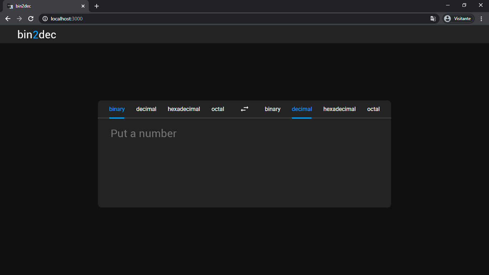

# bin2dec 

This is an atempt to create a base converter using React. It's inspired by another project called "app-ideas", which suggest some good ideas of apps to practice new skills/technologys by creating some basics apps besides the good and old "to do list". descreve o bin2dec

# Features

## Already Running

- Translate (v 1.0)

## Working on

- choose base bar effects

## Future features

- Translate (v 2.0)
- A step by step to show the translation process
- Mobile version

## Bugs to solve

- output infinito
- dinamic texarea

# Contributing

You can contribute to this project implementing the features to be implemented and sending a pull request.