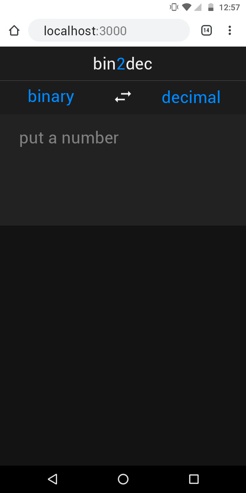
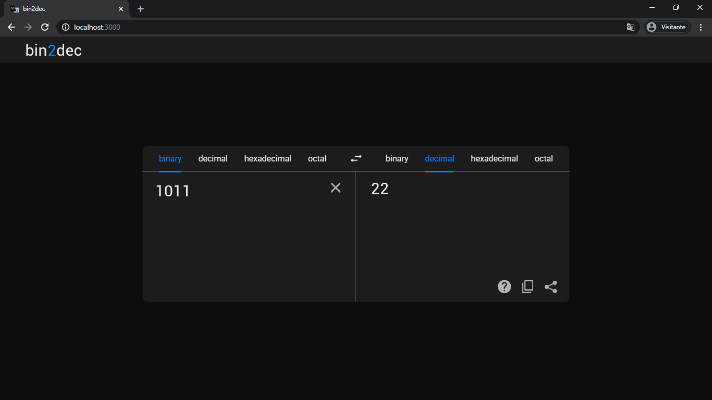
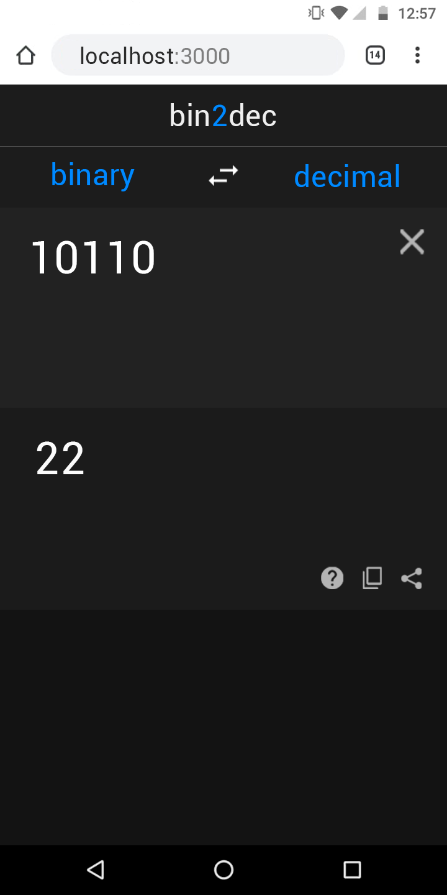

# bin2dec 

This is an atempt to create a base converter using [React](https://github.com/facebook/react). It's inspired by another project called [app-ideas](https://github.com/florinpop17/app-ideas), which suggest some creative ideas of apps to practice new skills/technologys instead the good old "to do list". The original idea is to make a simple binary to decimal translator, however, I decided to make something like a google translate for number and their number bases.

## Preview

Expected result (To be honest, have some details that I didn't decided yet)

### When the user enter in the page

&nbsp;

### In use

&nbsp;

## Getting started

These instructions will get you a copy of the project up and running on your local machine for development and testing purposes. See deployment for notes on how to deploy the project on a live system.

### Prerequisites

- [Node.js](https://nodejs.org/en)
- [React](https://reactjs.org/)
- [React Media](https://github.com/ReactTraining/react-media)
```$ npm install --save react-media```
- [React Router](https://reactrouter.com/web/guides/quick-start)
```$ npm install react-router-dom```

### Instaling

First, in the terminal, enter in the project folder and type

```$ git clone https://github.com/raissonsouto/bin2dec.git```

Than enter in the directory created

```$ cd bin2dec```

And finally, run the app

```$ npm start```

## Features

### Already Running

- Translate
- choose base bar effects

### Working on

- dinamic textarea
- Mobile version

### Future features

- Translate v2.0
- A step by step to show the translation process
- bin2bin (In bin2dec, the program translate a number in some base to the same number but in another base. In bin2bin (I didn't find in a better name), the idea is to translate this binary to another binary represetation (like two's complement, excess-128, etc))

## Contributing

You can contribute to this project implementing the features to be implemented and sending a pull request.

## Author

- **Raisson Souto**

## Acknowledgement

- [app-ideas](https://github.com/florinpop17/app-ideas)

